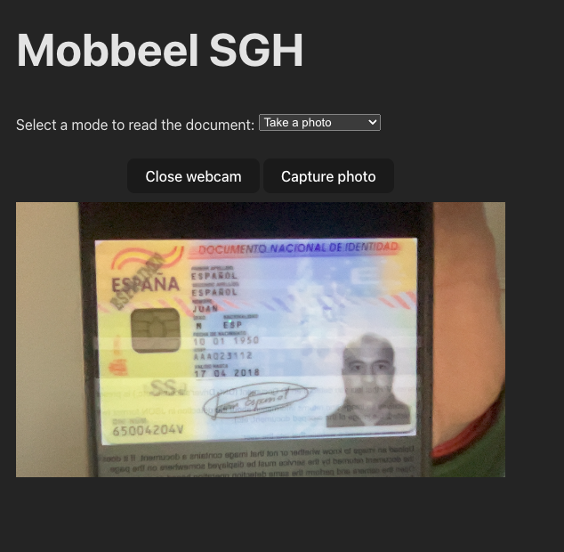

# Mobbeel Technical Challenge

## Made by: Sergio García Hernández

### Technology
- React v18.2.43
- Typescript v5.2.2
- Vite 5.0.8

### Other tools used
- [React Loader Spinner] (https://www.npmjs.com/package/react-loader-spinner)
- [React Webcam] (https://www.npmjs.com/package/react-webcam)
- ESLint

### Scripts
- `npm run dev`: Used to runs the server in development mode.
- `npm run build`: Used to build a production bundle of the app.

### Code structure
In order to have a structured code, I've decided to order de paths of the project as follows:
- `src/contexts`: This has the context that handle the behave of the application. Inside we have the `DocumentContext` that tells the application the state at all times and makes calls to the backend.
- `src/components`: Here are the individual components of the app. To separate components based on their behavior, we have differents directories:
  - `src/components/ui`: The UI components of the app. This components doesn't need a context to be used. Here we have the `LoaderSpinner`.
  - `src/components/document`: These components use the `DocumentContext` and need to be within it.
- `src/pages`: Every page inside here have the full screen that we'll see on the screen.
- `src/widgets`: The widgets are sections that have an own behave inside a page. For example, here we have the `FileLoaderWidget`, which is responsible for loading the file in the context using an input or the camera.

### How to use the app
This application provides a fundamental functionality: analyzing images to ascertain the presence of documents. By submitting an image, the application utilizes an advanced document detection system to identify and extract identification documents. If the image contains a document, the application visually displays the specific snippet of that document, offering an effective solution for digital identification and visual presentation of documents.

To provide images, you can do so in the following ways:
- Attach an image
- Take a photo of the document
- Take the image of a document with a real time video

### Deploy (CI)
The app is deployed on the site: https://sgh-mobbeel-technical-challenge.netlify.app/

It's linked to this repository and when I push my changes to the main branch of this repository they are automatically deployed to the Netlify environment.

### Screenshots

